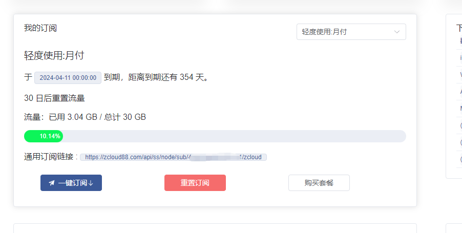

启动控制面板:
> docker run -p 1234:80 -d haishanh/yacd

导入配置文件当道指定目录
> curl --create-dirs https://zcloud88.com/api/ss/node/sub/{你的token}/clash  -o /home/clash/config.yaml

需要将命令中括号部分替换成你的token, [获取地址点这里](https://zcloud88.com/register?aff=zm6ycs)
下图中打码的部分为token

启动clash:
> docker run --name Clash -d -v /home/clash/config.yaml:/root/.config/clash/config.yaml --network="host" --privileged dreamacro/clash

开放端口:
9090 端口为clash的控制端口
7890 端口为clash的代理端口
1234 端口为yacd控制面板的端口

各个系统开启方式不一样,这里不做赘述,注意：如果使用云服务器,需要在云服务器的安全组中开放端口

随后访问控制面板 http://你的服务器ip:1234 
在控制面板连接clash的控制端口（http://你的服务器ip:9090）,即可使用